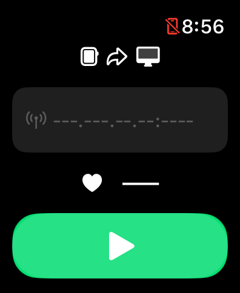
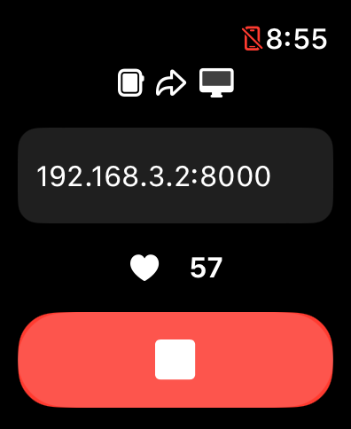

# HeartRateStreamer

An Apple Watch app that streams your real-time heart rate data to another device (e.g., PC) via the local network.

|||
| --- | --- |

## Quick Start

This repository contains a WatchOS app `HeartRateStreamer` for transmitting real-time heart rate data and a simple receiver `HeartRateReceiver` for testing. You can try this app by following these steps:

1. **Deploy the App**: Open `HeartRateStreamer/HeartRateStreamer.xcodeproj` with XCode, compile the WatchOS app, and deploy it to your Apple Watch.
2. **Deploy the Receiver**: On the receiving device (such as a PC), use Python to run the example receiver `HeartRateReceiver/main.py`. This program will start an HTTP server on port `8000` to receive heart rate data. Here is an example of the terminal output:
   ```
   INFO:root:Starting HTTP server...
   INFO:root:IP addresses: ['fe80::ce12:f9fa:b9a8:afc8', 'fe80::b078:4987:7979:86b9', '10.1.0.3', '192.168.   2', '172.29.0.1']
   INFO:root:Server port: 8000
   ```
1. **Check your Network**: Ensure that your **Apple Watch**, the **receiving device**, and the **iPhone paired with the Apple Watch** are on the same network.
2. **Start Transmission**: Launch the app on your Apple Watch, enter the address and port number of the receiving service in the input field (e.g. `192.168.3.2:8000`), and click the green button below to start transmitting heart rate data. You need to allow this app to access your health data and heart rate data when launching it for the first time.
3. **View the Data**: Once data transmission starts, the terminal of the receiving service will output the received heart rate data. Here is an example of the terminal output
   ```
   192.168.3.71 - - [15/Oct/2024 20:52:46] "POST /heart-rate-endpoint HTTP/1.1" 200 -
   INFO:root:{'timestamp': 1729021969.4095302, 'heartRate': 60}
   192.168.3.71 - - [15/Oct/2024 20:52:57] "POST /heart-rate-endpoint HTTP/1.1" 200 -
   INFO:root:{'heartRate': 57, 'timestamp': 1729021981.00441}
   192.168.3.71 - - [15/Oct/2024 20:53:03] "POST /heart-rate-endpoint HTTP/1.1" 200 -
   INFO:root:{'heartRate': 61.99999999999999, 'timestamp': 1729021986.300029}
   ```
4. **(Optional) Applications**: 
   - **For VRChat users**, you can install the Python module `python-osc`. When running the receiver example, it will send the heart rate data to the VRChat client via OSC protocol, the value of beat per minute will be set to the HR parameter of the avatar (See: [OSC Overview for VRChat](https://docs.vrchat.com/docs/osc-overview)).
   - **For OBS users**, you can add a browser source and set the URL to `http://REPLACE_WITH_RECEIVER_ADDRESS/heart-rate-endpoint` (or `http://127.0.0.1:8000/heart-rate-endpoint` if the receiver is on the same machine). Then, modify the custom CSS to:
     ```css
     body {
       background-color: rgba(0, 0, 0, 0);
       margin: 0px auto;
       overflow: hidden;
       color: #fc86c0;
       font-size: 200px;
       font-family: 'Brush Script MT', cursive;
     }
     ```


## FAQ

### Why I need my iPhone connected to the same network?

When the iPhone is available, the Apple Watch will prioritize routing any network data through the iPhone, and the data will be sent via the iPhone. When the iPhone is unavailable, it will use its own WiFi connection to send network data. (See: [Apple Documentation](https://developer.apple.com/documentation/watchos-apps/keeping-your-watchos-app-s-content-up-to-date#Test-your-update-code-with-different-configurations))
